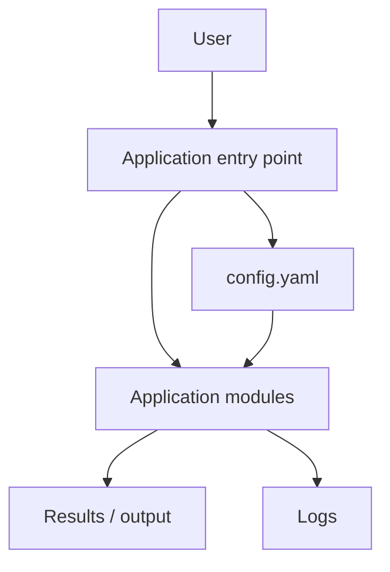

# System diagram

```mermaid
flowchart TD
    U[User] --> CLI[Application entry point]
    CLI --> CFG[config.yaml]
    CLI --> MOD[Application modules]
    CFG --> MOD
    MOD --> OUT[Results / output]
    MOD --> LOG[Logs]
```

Configuration is centralized in `config.yaml`; modules should receive their
settings from the corresponding configuration subsection.
